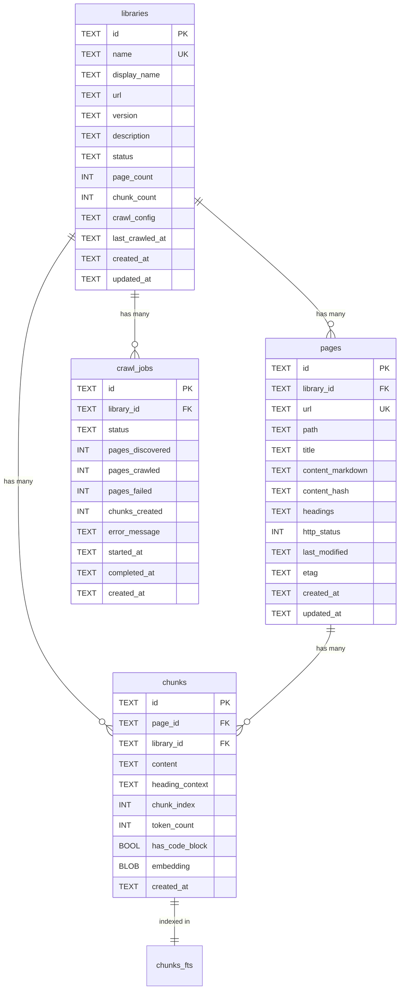

# Database Schema

SQLite database with FTS5 full-text search. Zero external dependencies — uses `better-sqlite3` which bundles SQLite natively.

← Back to [Plan Index](./index.md)

---

## Schema Overview



## Table Definitions

### `libraries`

The registry of documentation sources.

```sql
CREATE TABLE IF NOT EXISTS libraries (
  id              TEXT PRIMARY KEY,
  name            TEXT NOT NULL UNIQUE,        -- slug: "svelte-5"
  display_name    TEXT NOT NULL,               -- "Svelte 5"
  url             TEXT NOT NULL,               -- "https://svelte.dev/docs"
  version         TEXT,                        -- "5.0.0"
  description     TEXT,                        -- auto or user-provided
  status          TEXT NOT NULL DEFAULT 'pending',
    -- pending | crawling | indexed | error
  page_count      INTEGER NOT NULL DEFAULT 0,
  chunk_count     INTEGER NOT NULL DEFAULT 0,
  crawl_config    TEXT,                        -- JSON blob
  last_crawled_at TEXT,
  created_at      TEXT NOT NULL DEFAULT (datetime('now')),
  updated_at      TEXT NOT NULL DEFAULT (datetime('now'))
);

CREATE INDEX idx_libraries_status ON libraries(status);
CREATE INDEX idx_libraries_name ON libraries(name);
```

**`crawl_config` JSON shape:**
```json
{
  "maxDepth": 3,
  "include": ["/docs/*"],
  "exclude": ["/blog/*", "/changelog/*"],
  "renderer": "fetch",
  "rateLimit": 500,
  "userAgent": "DocShark/1.0"
}
```

### `pages`

Individual documentation pages with full markdown content.

```sql
CREATE TABLE IF NOT EXISTS pages (
  id               TEXT PRIMARY KEY,
  library_id       TEXT NOT NULL REFERENCES libraries(id) ON DELETE CASCADE,
  url              TEXT NOT NULL,              -- full URL
  path             TEXT NOT NULL,              -- relative: "/docs/introduction"
  title            TEXT,
  description      TEXT,                       -- meta description
  content_markdown TEXT,                       -- full converted content
  content_hash     TEXT,                       -- SHA-256 for diff detection
  headings         TEXT,                       -- JSON: heading hierarchy
  http_status      INTEGER,
  last_modified    TEXT,                       -- HTTP Last-Modified header
  etag             TEXT,                       -- HTTP ETag header
  created_at       TEXT NOT NULL DEFAULT (datetime('now')),
  updated_at       TEXT NOT NULL DEFAULT (datetime('now')),
  UNIQUE(library_id, url)
);

CREATE INDEX idx_pages_library ON pages(library_id);
CREATE INDEX idx_pages_path ON pages(library_id, path);
CREATE INDEX idx_pages_hash ON pages(content_hash);
```

**`headings` JSON shape:**
```json
[
  { "level": 1, "text": "Getting Started", "anchor": "getting-started" },
  { "level": 2, "text": "Installation", "anchor": "installation" },
  { "level": 2, "text": "Quick Start", "anchor": "quick-start" },
  { "level": 3, "text": "Using npm", "anchor": "using-npm" }
]
```

### `chunks`

Processed content segments optimized for search.

```sql
CREATE TABLE IF NOT EXISTS chunks (
  id              TEXT PRIMARY KEY,
  page_id         TEXT NOT NULL REFERENCES pages(id) ON DELETE CASCADE,
  library_id      TEXT NOT NULL REFERENCES libraries(id) ON DELETE CASCADE,
  content         TEXT NOT NULL,              -- the chunk text
  heading_context TEXT,                       -- "Getting Started > Installation"
  chunk_index     INTEGER NOT NULL,           -- order within page
  token_count     INTEGER,                    -- approximate token count
  has_code_block  INTEGER NOT NULL DEFAULT 0, -- boolean
  embedding       BLOB,                       -- optional vector embedding
  created_at      TEXT NOT NULL DEFAULT (datetime('now'))
);

CREATE INDEX idx_chunks_page ON chunks(page_id);
CREATE INDEX idx_chunks_library ON chunks(library_id);
```

### `chunks_fts` (FTS5 Virtual Table)

Full-text search index using Porter stemming + Unicode tokenization.

```sql
CREATE VIRTUAL TABLE IF NOT EXISTS chunks_fts USING fts5(
  content,
  heading_context,
  content=chunks,
  content_rowid=rowid,
  tokenize='porter unicode61 remove_diacritics 2'
);

-- Triggers to keep FTS5 in sync
CREATE TRIGGER chunks_ai AFTER INSERT ON chunks BEGIN
  INSERT INTO chunks_fts(rowid, content, heading_context)
  VALUES (NEW.rowid, NEW.content, NEW.heading_context);
END;

CREATE TRIGGER chunks_ad AFTER DELETE ON chunks BEGIN
  INSERT INTO chunks_fts(chunks_fts, rowid, content, heading_context)
  VALUES ('delete', OLD.rowid, OLD.content, OLD.heading_context);
END;

CREATE TRIGGER chunks_au AFTER UPDATE ON chunks BEGIN
  INSERT INTO chunks_fts(chunks_fts, rowid, content, heading_context)
  VALUES ('delete', OLD.rowid, OLD.content, OLD.heading_context);
  INSERT INTO chunks_fts(rowid, content, heading_context)
  VALUES (NEW.rowid, NEW.content, NEW.heading_context);
END;
```

### `crawl_jobs`

Async job tracking for crawl operations.

```sql
CREATE TABLE IF NOT EXISTS crawl_jobs (
  id              TEXT PRIMARY KEY,
  library_id      TEXT NOT NULL REFERENCES libraries(id) ON DELETE CASCADE,
  status          TEXT NOT NULL DEFAULT 'queued',
    -- queued | running | completed | failed | cancelled
  pages_discovered INTEGER NOT NULL DEFAULT 0,
  pages_crawled    INTEGER NOT NULL DEFAULT 0,
  pages_failed     INTEGER NOT NULL DEFAULT 0,
  chunks_created   INTEGER NOT NULL DEFAULT 0,
  error_message    TEXT,
  started_at       TEXT,
  completed_at     TEXT,
  created_at       TEXT NOT NULL DEFAULT (datetime('now'))
);

CREATE INDEX idx_jobs_library ON crawl_jobs(library_id);
CREATE INDEX idx_jobs_status ON crawl_jobs(status);
```

### `source_templates` (Seeded Data)

Pre-configured crawl configs for popular doc sites.

```sql
CREATE TABLE IF NOT EXISTS source_templates (
  id          TEXT PRIMARY KEY,
  name        TEXT NOT NULL,
  url         TEXT NOT NULL,
  version     TEXT,
  category    TEXT NOT NULL,     -- framework | library | tooling | language | reference
  crawl_config TEXT NOT NULL,    -- JSON
  icon        TEXT,              -- emoji
  popularity  INTEGER NOT NULL DEFAULT 0
);
```

## Key Queries

### Search (FTS5 + BM25 Ranking)

```sql
SELECT 
  c.id,
  c.content,
  c.heading_context,
  c.has_code_block,
  c.token_count,
  p.url AS page_url,
  p.title AS page_title,
  l.name AS library_name,
  l.display_name AS library_display_name,
  bm25(chunks_fts, 1.0, 0.5) AS relevance_score
FROM chunks_fts
JOIN chunks c ON chunks_fts.rowid = c.rowid
JOIN pages p ON c.page_id = p.id
JOIN libraries l ON c.library_id = l.id
WHERE chunks_fts MATCH :query
  AND (:library IS NULL OR l.name = :library)
ORDER BY relevance_score
LIMIT :limit;
```

### Library Stats

```sql
SELECT 
  l.*,
  COUNT(DISTINCT p.id) AS actual_page_count,
  COUNT(DISTINCT c.id) AS actual_chunk_count,
  SUM(LENGTH(p.content_markdown)) AS total_content_bytes
FROM libraries l
LEFT JOIN pages p ON p.library_id = l.id
LEFT JOIN chunks c ON c.library_id = l.id
GROUP BY l.id;
```

### Check for Existing Page (Diff-Aware Crawl)

```sql
SELECT content_hash, last_modified, etag
FROM pages
WHERE library_id = :libraryId AND url = :url;
```

## Storage Location

```
~/.docshark/                    -- default data directory
├── docshark.db                 -- SQLite database
├── docshark.db-wal             -- WAL mode journal
└── config.json                 -- user config overrides
```

Configurable via:
- `DOCSHARK_DATA_DIR` environment variable
- `--data-dir` CLI flag
- `docshark.config.json` in project root (auto-detected)

← Back to [Plan Index](./index.md)
