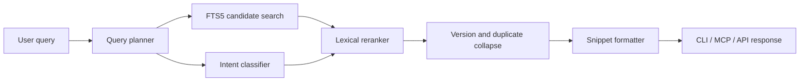
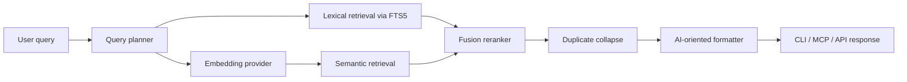
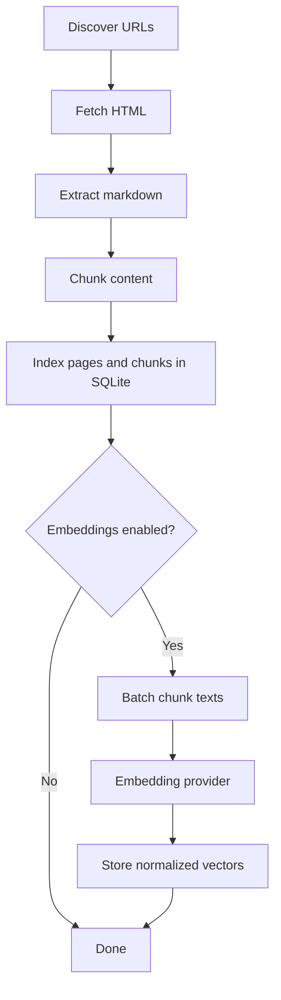
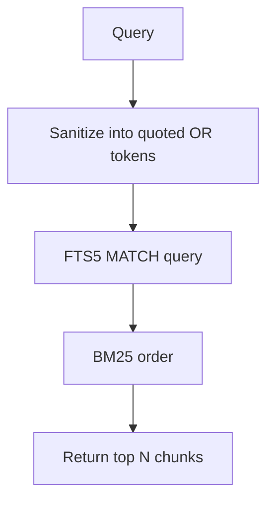
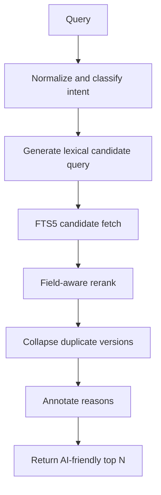
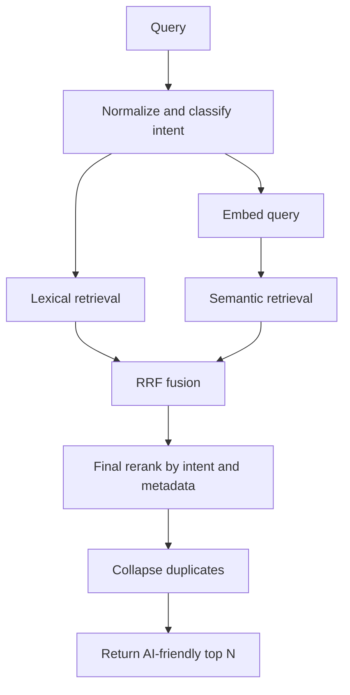
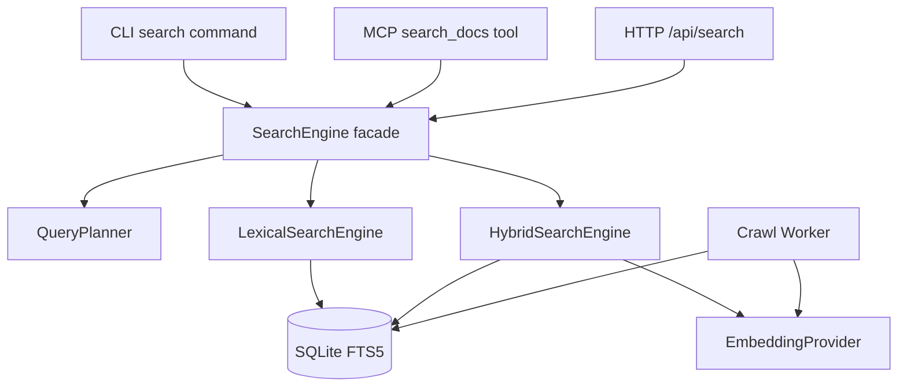

# DocShark Search Evolution Plan

This document lays out a concrete path for improving DocShark search beyond the current SQLite FTS5-only approach while preserving the project's strongest properties:

- local-first operation
- small operational surface area
- clean MCP ergonomics
- strong bundling story for an npm-distributed tool
- predictable performance on a laptop

The plan focuses on two phases:

1. **Option 1: FTS5++**
   Improve the current lexical search system with better query planning, ranking, deduplication, and AI-oriented result shaping.
2. **Option 2: Hybrid Search**
   Keep FTS5 as the fast lexical backbone, then add optional semantic retrieval and fusion ranking.

This is the recommended order. Phase 1 should land first. Phase 2 should build on top of Phase 1 rather than replacing it.

---

## 1. Current State

Today, DocShark search is intentionally simple.

- Chunks are stored in SQLite.
- `chunks_fts` is an FTS5 virtual table over `content` and `heading_context`.
- The query is sanitized by stripping quotes, splitting on whitespace, wrapping every term in quotes, and joining them with `OR`.
- Results are ranked with `bm25(chunks_fts, 1.0, 0.5)`.
- Both the CLI search command and the MCP `search_docs` tool call the same `SearchEngine`.

That simplicity is good for shipping, but it creates predictable quality limitations.

### 1.1 What We Observed with Capacitor

When querying for `capacitor`, both the CLI and MCP path returned very similar results.

- The retrieval path worked.
- The tool ergonomics were acceptable.
- The search quality was the weak point.

The top results skewed toward versioned `CLI Hooks` pages rather than a stronger overview or getting-started page. That indicates the problem is not MCP vs CLI transport. The problem is how candidates are selected and ranked.

### 1.2 Why the Current Strategy Misses

The current query planner is effectively:

```text
"capacitor" OR "getting" OR "started"
```

That has several consequences.

- Queries are overly broad.
- High-frequency keyword matches dominate.
- Versioned near-duplicate pages can crowd out better answers.
- Title and URL path semantics are not strongly rewarded.
- There is no intent model for differentiating:
  - overview queries
  - how-to queries
  - API reference queries
  - troubleshooting queries
- There is no semantic recall for synonyms or conceptual phrasing.

---

## 2. Design Goals

The next search system should optimize for the following, in this order.

### 2.1 Primary Goals

1. **Answer quality for AI workflows**
   The top few results should be the chunks an LLM actually wants to read next.
2. **Local-first packaging**
   The default install should remain practical for local use.
3. **Incremental adoption**
   Users should get value without being forced to configure external services.
4. **Shared search core**
   CLI, MCP, and HTTP API should keep delegating to the same search subsystem.
5. **Explainable ranking**
   Search should be debuggable. A result should be traceable to explicit ranking signals.

### 2.2 Secondary Goals

1. Keep latency low for FTS-only queries.
2. Preserve Bun + SQLite simplicity.
3. Avoid cross-platform native packaging headaches unless the value is clear.
4. Keep tool descriptions and outputs AI-friendly.

### 2.3 Non-Goals

1. Replacing SQLite with a dedicated search cluster.
2. Shipping a heavyweight always-on vector database in the first hybrid iteration.
3. Solving arbitrary web search.
4. Building a generic RAG platform.

---

## 3. Recommendation

The recommended roadmap is:

1. **Phase 1: FTS5++**
   Ship higher-quality lexical retrieval with query planning, scoring improvements, dedupe, and better result formatting.
2. **Phase 2: Hybrid Retrieval**
   Add optional embeddings and reciprocal rank fusion on top of the improved lexical system.

This ordering matters.

- Phase 1 improves relevance without adding operational burden.
- Phase 1 also creates the ranking primitives Phase 2 will need.
- Phase 2 becomes much simpler once lexical recall and output formatting are already strong.

---

## 4. Option 1: FTS5++

Option 1 is not “just tweak BM25.” It is a structured lexical retrieval layer with explicit ranking signals.

### 4.1 What Option 1 Adds

1. Query planning
2. Intent detection
3. Better candidate generation
4. Result deduplication across versions and duplicate pages
5. Multi-signal reranking
6. AI-oriented output shaping

### 4.2 High-Level Flow



### 4.3 Core Improvements

#### A. Query Planning

Instead of blindly OR-joining every token, the search system should derive a plan.

Example intent buckets:

- `overview`: “what is capacitor”, “capacitor overview”, “about capacitor”
- `getting_started`: “capacitor getting started”, “install capacitor”
- `api_lookup`: “capacitor camera plugin”, “CapacitorApp.addListener”
- `troubleshooting`: “capacitor android build fails”, “sync ios issue”

Query planning does not need to be ML-heavy. The first version can be deterministic.

Signals:

- leading verbs: `install`, `configure`, `create`, `use`, `fix`
- phrases: `getting started`, `overview`, `guide`, `reference`, `api`
- token shape: camelCase, dot notation, package names, CLI-like commands

#### B. Field-Aware Ranking

Right now the engine mostly scores chunk text and heading context. That leaves useful metadata underweighted.

The reranker should explicitly score:

- page title match
- heading match
- path match
- path type priors such as `/getting-started`, `/overview`, `/reference`, `/guides`, `/api`
- code block presence for API and troubleshooting queries
- chunk length sweet spot
- exact phrase match
- library filter match

#### C. Version Collapse

Capacitor search showed a recurring issue: multiple versioned pages with near-identical content compete for the top slots.

Phase 1 should collapse duplicates across versions when the query is not explicitly version-specific.

Examples:

- `v3/cli/hooks`
- `v4/cli/hooks`
- `v5/cli/hooks`
- `v6/cli/hooks`
- `v7/cli/hooks`

If the user did not ask for a version, the engine should prefer:

- latest stable page
- canonical unversioned page if present

#### D. Better AI Output

The current tool output is readable, but it does not explain _why_ the result is relevant.

The formatted result should expose a compact rationale:

- exact match in title
- matched getting-started path
- includes code sample
- latest version

This makes MCP output easier for agents to reason about and easier for humans to debug.

### 4.4 Proposed Code Shape for Option 1

This is not final code. It is a concrete skeleton showing likely module boundaries.

```ts
// packages/core/src/search/types.ts
export type SearchIntent =
  | "general"
  | "overview"
  | "getting_started"
  | "api_lookup"
  | "troubleshooting";

export interface SearchOptions {
  library?: string;
  limit?: number;
  mode?: "lexical" | "hybrid";
  debug?: boolean;
}

export interface SearchPlan {
  originalQuery: string;
  normalizedQuery: string;
  intent: SearchIntent;
  phrases: string[];
  keywords: string[];
  requestedVersion?: string;
  requestedLibrary?: string;
}

export interface RankedSearchResult {
  pageUrl: string;
  pageTitle: string;
  libraryName: string;
  headingContext: string;
  content: string;
  lexicalScore: number;
  rerankScore: number;
  reasons: string[];
  hasCodeBlock: boolean;
  tokenCount: number;
}
```

```ts
// packages/core/src/search/query-planner.ts
import type { SearchIntent, SearchPlan } from "./types.js";

export class QueryPlanner {
  build(query: string, library?: string): SearchPlan {
    const normalizedQuery = query.trim().toLowerCase();
    const intent = this.detectIntent(normalizedQuery);
    const phrases = this.extractPhrases(normalizedQuery);
    const keywords = this.extractKeywords(normalizedQuery);

    return {
      originalQuery: query,
      normalizedQuery,
      intent,
      phrases,
      keywords,
      requestedLibrary: library,
      requestedVersion: this.extractVersion(normalizedQuery),
    };
  }

  private detectIntent(query: string): SearchIntent {
    if (query.includes("getting started") || query.startsWith("install ")) {
      return "getting_started";
    }
    if (query.includes("overview") || query.startsWith("what is ")) {
      return "overview";
    }
    if (/[a-z]+\.[a-z]+|[A-Z][a-zA-Z]+\(/.test(query)) {
      return "api_lookup";
    }
    if (/error|fail|issue|problem|broken|fix/.test(query)) {
      return "troubleshooting";
    }
    return "general";
  }

  private extractPhrases(query: string): string[] {
    const phrases: string[] = [];
    if (query.includes("getting started")) phrases.push("getting started");
    if (query.includes("quickstart")) phrases.push("quickstart");
    if (query.includes("overview")) phrases.push("overview");
    return phrases;
  }

  private extractKeywords(query: string): string[] {
    return query.split(/\s+/).filter(Boolean);
  }

  private extractVersion(query: string): string | undefined {
    const match = query.match(/\bv(\d+)\b/);
    return match ? match[1] : undefined;
  }
}
```

```ts
// packages/core/src/search/lexical-search-engine.ts
import type { Database } from "../storage/db.js";
import type { RankedSearchResult, SearchOptions, SearchPlan } from "./types.js";

export class LexicalSearchEngine {
  constructor(private db: Database) {}

  search(plan: SearchPlan, opts: SearchOptions = {}): RankedSearchResult[] {
    const candidates = this.fetchCandidates(plan, opts);
    const ranked = this.rerank(plan, candidates);
    const collapsed = this.collapseDuplicates(plan, ranked);
    return collapsed.slice(0, opts.limit ?? 5);
  }

  private fetchCandidates(plan: SearchPlan, opts: SearchOptions) {
    // FTS5 retrieval with broader recall than final output.
    return [];
  }

  private rerank(plan: SearchPlan, candidates: RankedSearchResult[]) {
    return candidates;
  }

  private collapseDuplicates(
    plan: SearchPlan,
    candidates: RankedSearchResult[],
  ) {
    return candidates;
  }
}
```

### 4.5 Proposed Storage Changes for Option 1

Option 1 can stay light. It does not need a vector index. It may benefit from a few metadata additions.

Potential additions:

```sql
ALTER TABLE pages ADD COLUMN path_type TEXT;
ALTER TABLE pages ADD COLUMN version_tag TEXT;
ALTER TABLE pages ADD COLUMN is_canonical INTEGER NOT NULL DEFAULT 0;
ALTER TABLE pages ADD COLUMN title_normalized TEXT;
```

Possible `path_type` examples:

- `overview`
- `getting_started`
- `guide`
- `reference`
- `api`
- `troubleshooting`

These can be derived during indexing from page URL, title, and heading patterns.

### 4.6 Ranking Formula for Option 1

The lexical reranker should be explicit and tunable.

Example:

$$
score =
0.45 \cdot bm25 +
0.20 \cdot titleMatch +
0.10 \cdot headingMatch +
0.10 \cdot pathPrior +
0.05 \cdot phraseMatch +
0.05 \cdot codeSignal +
0.05 \cdot freshnessOrCanonicality
$$

This does not need to be mathematically perfect on day one. It needs to be understandable and easy to tune against a query benchmark set.

### 4.7 Pros and Cons of Option 1

| Category                      | Assessment                                                       |
| ----------------------------- | ---------------------------------------------------------------- |
| Search quality                | Good step up for navigational and explicit documentation queries |
| Implementation complexity     | Low to medium                                                    |
| Bundling ease                 | Excellent                                                        |
| Operational complexity        | Excellent                                                        |
| AI friendliness               | Good, especially once result reasons are exposed                 |
| Integration effort            | Low                                                              |
| Recall for conceptual queries | Still limited                                                    |

### 4.8 Where Option 1 Wins

Option 1 is strongest when the user already uses language close to the docs.

Examples:

- `capacitor getting started`
- `svelte transition fade`
- `tailwind container query`
- `valibot custom schema`

### 4.9 Where Option 1 Still Fails

Option 1 remains weaker on conceptual, paraphrased, or synonym-heavy prompts.

Examples:

- `how do I bridge web code to native mobile features`
- `how to make a plugin run after mobile app sync`
- `what is the recommended mobile runtime for a web app`

These are exactly the kinds of inputs that push us toward Option 2.

---

## 5. Option 2: Hybrid Search

Option 2 should be understood as **FTS5 plus optional semantic retrieval**, not “replace everything with vectors.”

FTS5 remains valuable because it is:

- fast
- deterministic
- explainable
- great for exact API names, package names, and code identifiers

Semantic retrieval adds the missing piece: better recall for natural-language and conceptual queries.

### 5.1 High-Level Hybrid Flow



### 5.2 Why Hybrid Instead of Pure Semantic

Pure semantic search is attractive in demos but weaker in documentation reality.

- It can miss exact method names.
- It can over-associate vague conceptual neighbors.
- It is harder to explain.
- It introduces embedding lifecycle complexity.

Hybrid search gives DocShark the best shape for agent use.

- lexical retrieval for exactness
- semantic retrieval for concept match
- fusion for better top-k answers

### 5.3 Recommended First Hybrid Architecture

The first hybrid version should avoid a native vector extension.

This is important for bundling.

#### Recommended approach

1. Store chunk embeddings in SQLite as blobs or compact serialized arrays.
2. Normalize vectors at write time.
3. Compute query embeddings on demand.
4. Retrieve semantic candidates with in-process cosine similarity.
5. Fuse lexical and semantic rankings with Reciprocal Rank Fusion.

This sounds simple because it is simple.

For DocShark's current scale, this is a pragmatic first version.

Advantages:

- no sqlite extension packaging problem
- no separate vector service
- no HNSW native module requirement
- works offline when paired with a local embedding provider
- easy to feature-flag

Trade-off:

- semantic retrieval will eventually need optimization as corpus size grows

That is acceptable. It is the correct first hybrid design for this repository.

### 5.4 Recommended Embedding Provider Strategy

Do **not** hardwire one model provider into the core.

Use a provider interface.

```ts
// packages/core/src/search/embeddings/types.ts
export interface EmbeddingProvider {
  name: string;
  dimensions: number;
  embedQuery(text: string): Promise<Float32Array>;
  embedDocuments(texts: string[]): Promise<Float32Array[]>;
}

export interface EmbeddingConfig {
  enabled: boolean;
  provider: "ollama" | "openai" | "openai-compatible";
  model: string;
  baseUrl?: string;
  apiKeyEnv?: string;
}
```

Recommended initial providers:

1. `ollama`
   Best local-first story.
2. `openai-compatible`
   Lets advanced users point at OpenAI, OpenRouter, local gateways, or other compatible providers.

Why not bundle an ONNX sentence-transformer immediately?

- package size gets worse fast
- model download complexity appears immediately
- platform support becomes more annoying
- startup and cache behavior get more fragile

That can come later if there is a strong reason.

### 5.5 Proposed Storage Model for Option 2

```sql
CREATE TABLE IF NOT EXISTS chunk_embeddings (
  chunk_id TEXT PRIMARY KEY REFERENCES chunks(id) ON DELETE CASCADE,
  library_id TEXT NOT NULL REFERENCES libraries(id) ON DELETE CASCADE,
  model TEXT NOT NULL,
  dimensions INTEGER NOT NULL,
  embedding BLOB NOT NULL,
  created_at TEXT NOT NULL DEFAULT (datetime('now'))
);

CREATE INDEX IF NOT EXISTS idx_chunk_embeddings_library_id
ON chunk_embeddings(library_id);
```

Optional later addition:

```sql
CREATE TABLE IF NOT EXISTS page_embeddings (
  page_id TEXT PRIMARY KEY REFERENCES pages(id) ON DELETE CASCADE,
  library_id TEXT NOT NULL REFERENCES libraries(id) ON DELETE CASCADE,
  model TEXT NOT NULL,
  dimensions INTEGER NOT NULL,
  embedding BLOB NOT NULL,
  created_at TEXT NOT NULL DEFAULT (datetime('now'))
);
```

`page_embeddings` can be useful for a two-stage semantic pipeline.

- stage 1: find promising pages
- stage 2: rank chunks inside those pages

That helps control brute-force costs later.

### 5.6 Indexing Pipeline Changes for Option 2

Hybrid search is not just a query-time change. It affects indexing.



The embedding step should be:

- optional
- batched
- resumable
- visible in crawl job progress

This is important because users should not have to guess whether a library is “indexed but not semantically indexed yet.”

### 5.7 Proposed Search Code Shape for Option 2

```ts
// packages/core/src/search/hybrid-search-engine.ts
import type { Database } from "../storage/db.js";
import type { EmbeddingProvider } from "./embeddings/types.js";
import type { RankedSearchResult, SearchOptions, SearchPlan } from "./types.js";

export class HybridSearchEngine {
  constructor(
    private db: Database,
    private lexical: LexicalSearchEngine,
    private embeddings?: EmbeddingProvider,
  ) {}

  async search(
    plan: SearchPlan,
    opts: SearchOptions = {},
  ): Promise<RankedSearchResult[]> {
    const lexicalCandidates = this.lexical.search(plan, {
      ...opts,
      limit: 40,
    });

    if (!this.embeddings) {
      return lexicalCandidates.slice(0, opts.limit ?? 5);
    }

    const queryVector = await this.embeddings.embedQuery(plan.originalQuery);
    const semanticCandidates = this.semanticSearch(queryVector, plan, opts);

    const fused = this.fuseRankings(lexicalCandidates, semanticCandidates);
    const reranked = this.finalRerank(plan, fused);
    return reranked.slice(0, opts.limit ?? 5);
  }

  private semanticSearch(
    queryVector: Float32Array,
    plan: SearchPlan,
    opts: SearchOptions,
  ): RankedSearchResult[] {
    return [];
  }

  private fuseRankings(
    lexical: RankedSearchResult[],
    semantic: RankedSearchResult[],
  ): RankedSearchResult[] {
    return [];
  }

  private finalRerank(
    plan: SearchPlan,
    candidates: RankedSearchResult[],
  ): RankedSearchResult[] {
    return candidates;
  }
}
```

### 5.8 Fusion Strategy

Use Reciprocal Rank Fusion first.

It is robust, simple, and does not require score normalization gymnastics.

$$
RRF(d) = \sum_{r \in rankers} \frac{1}{k + rank_r(d)}
$$

Where:

- $d$ is a document or chunk
- $rank_r(d)$ is the rank assigned by a given retriever
- $k$ is a smoothing constant such as $60$

Why RRF here:

- BM25 scores and cosine scores live on different scales
- RRF avoids brittle hand-normalization
- it is widely used in hybrid retrieval systems
- it is easy to debug

### 5.9 Hybrid Search Modes

The system should support explicit search modes.

```ts
export type SearchMode = "lexical" | "hybrid" | "auto";
```

Behavior:

- `lexical`: always use Option 1 only
- `hybrid`: require embeddings, fail gracefully if unavailable
- `auto`: use hybrid if embeddings exist, otherwise lexical

This matters for both CLI and MCP because it prevents “magic behavior” that users cannot reason about.

### 5.10 MCP, CLI, and API Shape

The user-facing API should not fragment.

Recommended approach:

- keep `search_docs` as the primary MCP tool
- extend its schema with optional `mode`
- keep CLI `search` as the primary command
- extend it with `--mode lexical|hybrid|auto`
- extend HTTP `/api/search` the same way

Example MCP schema evolution:

```ts
schema: v.object({
  query: v.pipe(
    v.string(),
    v.description("Search query. Use natural language."),
  ),
  library: v.optional(
    v.pipe(v.string(), v.description("Filter to a specific library.")),
  ),
  mode: v.optional(
    v.pipe(
      v.picklist(["lexical", "hybrid", "auto"]),
      v.description("Search mode. Default: auto."),
    ),
    "auto",
  ),
  limit: v.optional(
    v.pipe(v.number(), v.integer(), v.minValue(1), v.maxValue(20)),
    5,
  ),
});
```

Possible future MCP addition:

- `explain_search_result`

That is not necessary in the first hybrid release, but it could be valuable for debugging ranking behavior.

### 5.11 AI-Oriented Result Shape

Hybrid search should expose richer metadata, not just richer ranking.

Suggested per-result metadata:

- source URL
- page title
- heading context
- library name
- whether the result came from lexical, semantic, or both
- reasons for ranking
- version info if detected
- code block presence

Example:

```text
### 1. Installing Capacitor | Capacitor Documentation
Source: https://capacitorjs.com/docs/getting-started
Why this ranked highly:
- exact match for "capacitor"
- path classified as getting_started
- semantic similarity matched installation intent
- canonical unversioned page preferred over versioned duplicates
```

This is much better for agent behavior than a bare snippet.

### 5.12 Pros and Cons of Option 2

| Category                  | Assessment                                               |
| ------------------------- | -------------------------------------------------------- |
| Search quality            | Very good to excellent if tuned well                     |
| Implementation complexity | Medium                                                   |
| Bundling ease             | Good if provider-based, weaker if local model is bundled |
| Operational complexity    | Good when embeddings are optional                        |
| AI friendliness           | Excellent                                                |
| Integration effort        | Medium                                                   |
| Explainability            | Good with reasons and debug mode                         |

### 5.13 Where Option 2 Wins

Option 2 is strongest when users search conceptually or with different language than the docs use.

Examples:

- `how do I add native device features to a web app`
- `mobile runtime for web technologies`
- `how to sync changes to ios and android project shells`

### 5.14 Where Option 2 Can Still Go Wrong

Hybrid search is not magic.

Failure modes:

- bad or poorly matched embedding model
- outdated semantic index after refresh
- semantic drift toward conceptually similar but wrong docs
- long-tail API identifier lookups where lexical should dominate

That is why lexical retrieval must remain first-class.

---

## 6. Comparison Table

| Dimension             | Option 1: FTS5++      | Option 2: Hybrid             |
| --------------------- | --------------------- | ---------------------------- |
| Core idea             | Better lexical search | Lexical plus semantic search |
| Quality gain          | Moderate              | High                         |
| Exact API lookups     | Excellent             | Excellent                    |
| Conceptual queries    | Fair to good          | Good to excellent            |
| Local-first story     | Excellent             | Good to excellent            |
| Bundling ease         | Excellent             | Good if provider-based       |
| Implementation effort | Low to medium         | Medium                       |
| Runtime complexity    | Low                   | Medium                       |
| AI usability          | Good                  | Excellent                    |
| Debuggability         | Excellent             | Good                         |
| Recommendation        | Ship first            | Ship second                  |

---

## 7. Bundling Strategy

Bundling is a serious design constraint for DocShark because this project wants to be easy to install and run locally.

### 7.1 Option 1 Bundling Story

Option 1 is nearly ideal.

- no new service
- no model downloads
- no native extension
- no large package assets

This should have minimal impact on npm distribution.

### 7.2 Option 2 Bundling Story

Option 2 can still have a good bundling story if designed correctly.

Recommended principle:

> Bundle the hybrid engine logic, not the embedding model weights.

That means:

- the package ships the provider interface
- the package ships provider adapters
- embeddings are optional
- users opt into Ollama or an OpenAI-compatible endpoint

This avoids:

- huge package size
- postinstall downloads
- platform-specific native headaches
- surprise startup costs

### 7.3 Bundling Recommendation

Use this staged rule:

1. Ship Option 1 in the main package with no caveats.
2. Ship Option 2 provider support in the main package, but disabled by default.
3. Require explicit config to enable embeddings.
4. Defer bundled local transformer models until real demand justifies the complexity.

---

## 8. Ease of Integration

### 8.1 Option 1

Integration effort is low because it mostly touches:

- `src/storage/search.ts`
- query planning helpers
- result formatting
- perhaps lightweight metadata columns in `pages`

### 8.2 Option 2

Integration effort is moderate because it touches:

- crawl/index pipeline
- storage schema
- job progress model
- search API surface
- configuration
- ranking and debug output

That is still acceptable because it remains within the existing DocShark architecture. It does not require introducing a second database or changing MCP patterns.

---

## 9. Suggested File Layout

One clean way to structure the search evolution is this:

```text
packages/core/src/
  search/
    types.ts
    query-planner.ts
    lexical-search-engine.ts
    hybrid-search-engine.ts
    ranking.ts
    dedupe.ts
    format-results.ts
    embeddings/
      types.ts
      ollama-provider.ts
      openai-compatible-provider.ts
  storage/
    db.ts
    search.ts
```

`storage/search.ts` could then become a compatibility layer or facade.

Example:

```ts
// packages/core/src/storage/search.ts
import type { Database } from "./db.js";
import { QueryPlanner } from "../search/query-planner.js";
import { LexicalSearchEngine } from "../search/lexical-search-engine.js";
import { HybridSearchEngine } from "../search/hybrid-search-engine.js";
import type { SearchOptions } from "../search/types.js";

export class SearchEngine {
  private planner = new QueryPlanner();
  private lexical: LexicalSearchEngine;
  private hybrid: HybridSearchEngine;

  constructor(private db: Database) {
    this.lexical = new LexicalSearchEngine(db);
    this.hybrid = new HybridSearchEngine(db, this.lexical);
  }

  async search(query: string, opts: SearchOptions = {}) {
    const plan = this.planner.build(query, opts.library);

    if (opts.mode === "lexical") {
      return this.lexical.search(plan, opts);
    }

    return this.hybrid.search(plan, opts);
  }
}
```

This preserves the public surface while making the internals easier to evolve.

---

## 10. Flow Charts

### 10.1 Current Search Flow



### 10.2 Proposed Phase 1 Flow



### 10.3 Proposed Phase 2 Flow



### 10.4 Component Diagram



---

## 11. Suggested Rollout Plan

### Phase 1A

1. Introduce query planner.
2. Fetch more lexical candidates than final output.
3. Add reranker with title, heading, path, phrase, and code signals.
4. Add duplicate/version collapse.
5. Improve formatted result rationale.

### Phase 1B

1. Add lightweight benchmark set.
2. Add debug output for ranking reasons.
3. Tune scoring weights against representative queries.

### Phase 2A

1. Add embedding provider abstraction.
2. Add optional embedding config.
3. Add `chunk_embeddings` storage.
4. Add embedding generation in crawl pipeline.
5. Add `mode` to CLI, MCP, and HTTP API.

### Phase 2B

1. Add semantic retrieval.
2. Add RRF fusion.
3. Add result provenance and ranking reasons.
4. Tune against benchmark queries.

### Phase 2C

1. Profile scaling limits.
2. Decide whether page-level embeddings or ANN indexing are needed.
3. Only then evaluate sqlite-vec or other acceleration options.

---

## 12. Concrete Recommendation

If we want the best balance of quality, implementation cost, bundling ease, and AI usability, the right plan is:

1. **Build Option 1 first**
   This will materially improve current search quality, fix obvious ranking issues like the Capacitor case, and keep the package simple.
2. **Build Option 2 on top of it**
   Add optional provider-based embeddings and hybrid fusion without changing the core local-first story.
3. **Do not start with a native vector extension**
   That would make packaging and cross-platform support harder too early.

This gives DocShark a search stack that is:

- fast by default
- smarter for AI workflows
- still easy to install
- ready to grow without throwing away the current architecture

---

## 13. What This Would Look Like for Users

### CLI

```bash
docshark search "capacitor" --mode lexical
docshark search "how do I add native mobile features to a web app" --mode hybrid
docshark search "capacitor getting started" --library capacitorjs-docs --mode auto
```

### MCP

```json
{
  "query": "capacitor getting started",
  "library": "capacitorjs-docs",
  "mode": "auto",
  "limit": 5
}
```

### Returned result shape

```text
### 1. Installing Capacitor | Capacitor Documentation
Source: https://capacitorjs.com/docs/getting-started
Section: Install Capacitor
Why this ranked highly:
- exact title match
- getting-started page type
- canonical unversioned page
- matched installation intent

In the root of your app, install Capacitor's main npm dependencies...
```

That is the type of response an LLM can use reliably.

---

## 14. Decision Summary

If the question is “what should DocShark build next for search?”, the answer is:

- **immediately**: Phase 1 lexical improvements
- **next**: optional hybrid retrieval with provider-based embeddings
- **not yet**: native vector extensions or a separate search service

That path is the highest-quality fit for this repository.

---

## 15. Validation And Implementation Notes

### 15.1 Document-Based Checkpoints

This section is intentionally based on the design document itself, not on external research results. The plan assumes the following architecture already in scope:

- the CLI, MCP server, and HTTP API all share the same search core
- Phase 1 stays lexical and local-first
- FTS5 remains the index backbone
- ranking is improved by query planning and reranking rather than by a new storage layer

### 15.2 Phase 1 Implementation Adjustment

The original design mentioned possible new page metadata columns such as `path_type`, `version_tag`, `is_canonical`, and `title_normalized`.

The first implementation deliberately defers those schema changes.

Instead, Phase 1 computes the following at query time:

- query intent
- path type heuristics
- version tags from URL paths
- canonical page grouping for duplicate collapse
- reason strings for AI-oriented result output

This keeps the first release of Option 1 low-risk:

- no database migration required
- no index rebuild required
- no CLI or MCP contract breakage required
- ranking quality improves immediately on existing indexed libraries

### 15.3 What Phase 1 Means In Practice

The Phase 1 search shape is:

1. plan the query
2. fetch a broader FTS5 candidate set
3. rerank with title, heading, path, phrase, code, and version signals
4. collapse duplicate pages and duplicate version families
5. return results with short ranking rationales

That is the minimal local-first implementation described by this document.
